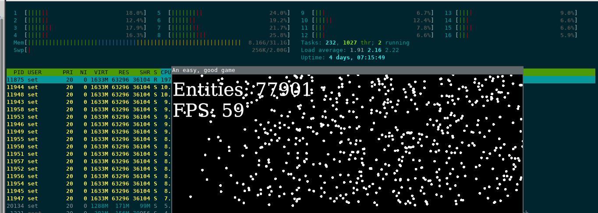

# specsSpawnEntities
I continue to study Rust. This time experimenting with spawning entities with [specs](https://github.com/amethyst/specs) library.

This can spawn more than 70k entities and continue processing them on 60fps.

The only optimization is that entities that are our of the screen borders are not rendered. Otherwise, the limit would be in about 4k drawcalls per game loop.

